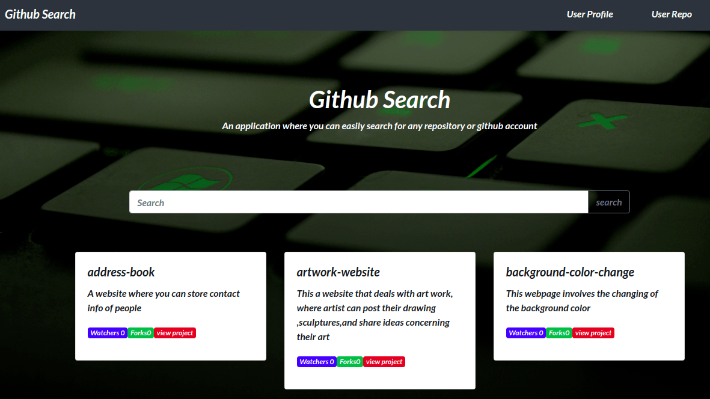

# Github Search
This is an application where the user enters their github usernames and it generates the profile of the individual and also it generates all the repositories of the user.The website link is [here](https://tomito26.github.io/GitSearch/)




## Author 
* Thomas Khaemba

## Installations
* nodejs
* npm
* angularCLI
* typescript

## Project Setup
Copy the repository link from github  then follow the steps below;
first paste the link to clone the project 
```
$ git clone <repo>
```
After cloning  go to the directory/folder of the project you have cloned
```
$ cd  project-directory/folder
```
You then type [code .]() for VS code and [atom .]()for atom 
```
$ code ./atom .
```
To access the the live webpage you just type ng serve 
```
$ ng serve --open
```
Or you can pick the option of downlading the zip file of the project then you right click and choose extract  then you follow the steps above  on getting into the directory to the  to accessing the live webpage
 
 
 ## Technologies Used
 * HTML5
 * CSS3
 * Angular
 * Typescript
 * Git API
## Support & Contact
For any assistance or collaboration reach out to me on tommybwah@gmail.com
## Copyright and License
Licensed under [MIT license](license)

 

 

  